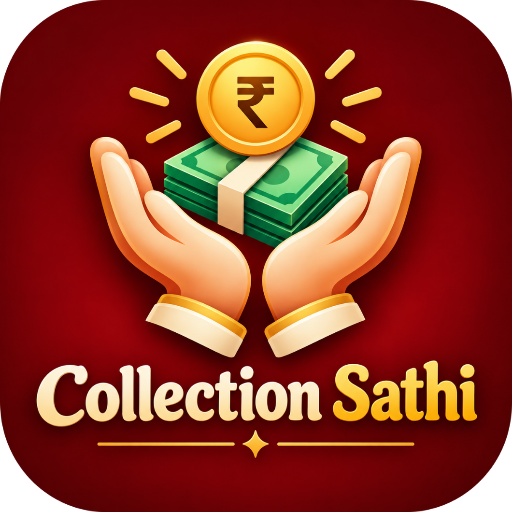
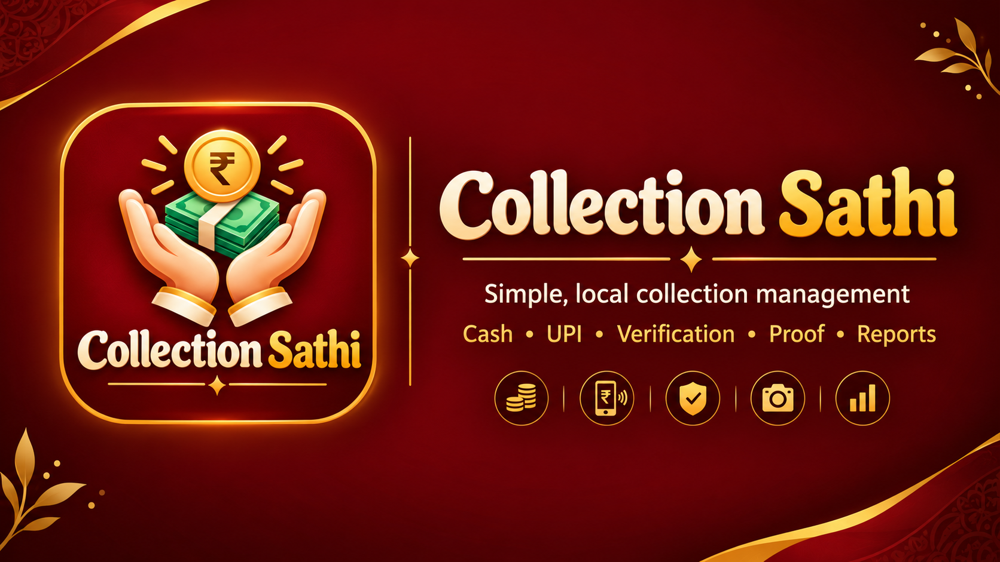

<table>
<tr>
<td></td>
<td>

# Collection Sathi
Simple, local-first collection tracking — Cash + UPI, verified payments, history & instant invoices.

</td>
</tr>
</table>

  
  
  

A free, open-source app to track group money collections — built for **chanda, festival funds, class collections, and community contributions**. No login, no server — everything stays on your device.

---
> **Simple • Local • Open Source • Collection Management**

Collection Sathi is a lightweight, mobile-first web application for recording group money collections with **Cash + UPI support**, **multi-round history**, **UPI verification**, **payment-proof image archiving**, **summaries**, **printable invoices**, **image sharing**, and a locally saved **UPI QR code**.

It is designed for practical collection workflows such as **chanda, festival funds, class collections, community contributions, events, and small group records**.

---

# Collection Sathi

  

  <strong>Simple, local collection management.</strong> 
  Record collections, verify UPI payments, preserve payment proofs, and generate clean reports.

  
  &nbsp;
  
  &nbsp;
  

  Cash • UPI • Verification • Payment Proof • History • Reports

---

## ✨ Features

| | |
|---|---|
| 👥 **People** | Reusable person records, no re-typing names |
| 💵📲 **Cash + UPI** | Track both, with per-entry mode |
| ✅ **UPI Verification** | Mark verified, attach proof, or self-verify |
| 🔄 **Multiple Rounds** | Independent collection sessions with full history |
| 📊 **Summary** | Totals, average, max, Cash/UPI split |
| 🧾 **Invoice** | Printable, signed, shareable as an image |
| 🔳 **UPI QR** | Save your QR once, reuse every round |
| 💾 **Local-first** | Your data never leaves your device |

## 🧭 Sections

| Collect | Summary | History | Invoice |
|---|---|---|---|
| Add & verify payments | Totals & stats | All rounds, switch anytime | Print, PDF, share |

## 🛠️ Tech Stack

Plain HTML, CSS & JavaScript — no framework required.

`localStorage` · `IndexedDB` · Canvas API · Web Share API · Service Worker · Web App Manifest · `html2canvas`

## 🚧 Production Readiness

Currently in **active development** — functional and usable, not yet a finished v1.

**Ready:** core collection flow · invoices (print/share) · UPI verification + proof storage · local persistence · installable PWA
**Not yet ready:** backup/export · cross-device testing · signed release APK · versioned releases

> Use it for real collections at your own discretion — keep a manual backup of totals until export/backup ships.

## 🗺️ Roadmap

- [ ] Export / Import (JSON, CSV)
- [ ] Search & filter entries
- [ ] Proof archive viewer + cleanup
- [ ] Dark mode
- [ ] Signed, versioned APK releases
- [ ] F-Droid listing
- [ ] Optional encrypted backup

## 🤝 Contributing

Contributions are welcome — keep changes compatible with existing stored data, and test on mobile before submitting.

## 📄 License

MIT — free to use, modify, and share.

## 🙏 Credits

Made by **[Vinay Soni](https://github.com/VinaySoni-IN)** · Built with **[Claude](https://claude.ai)**
