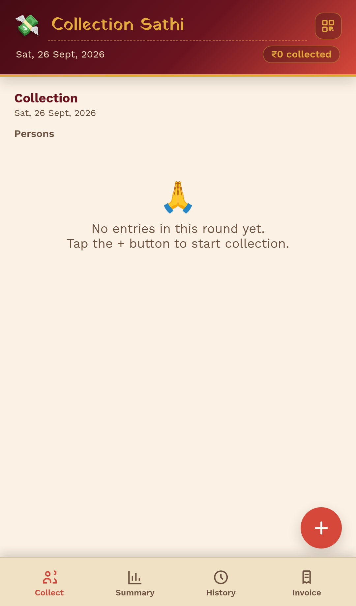
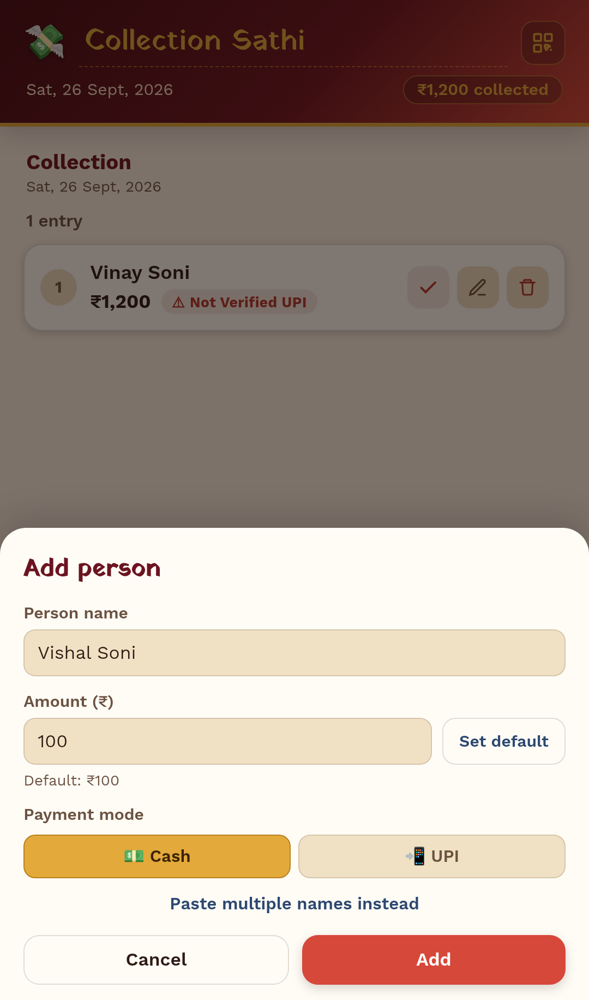
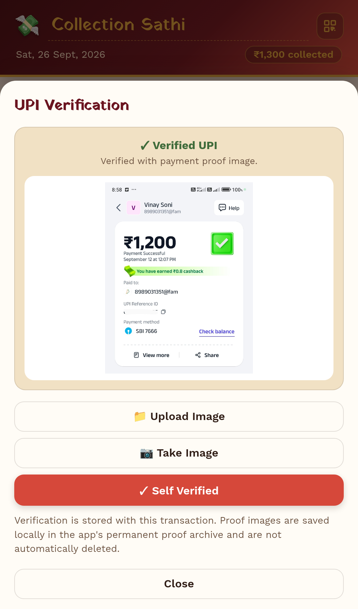
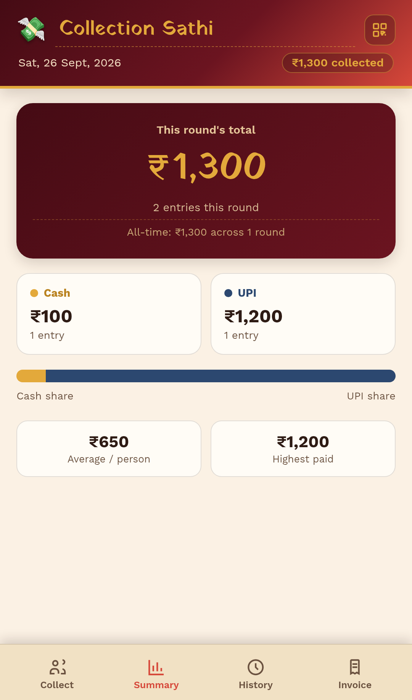
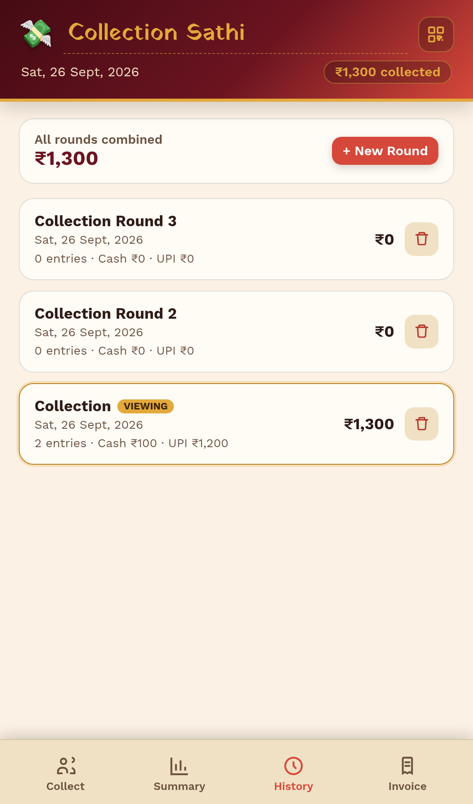
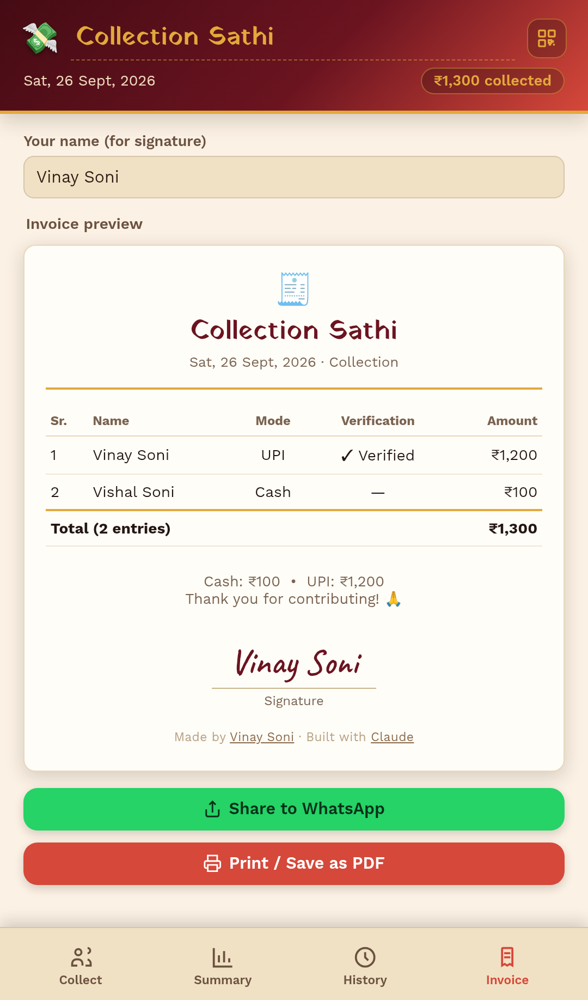
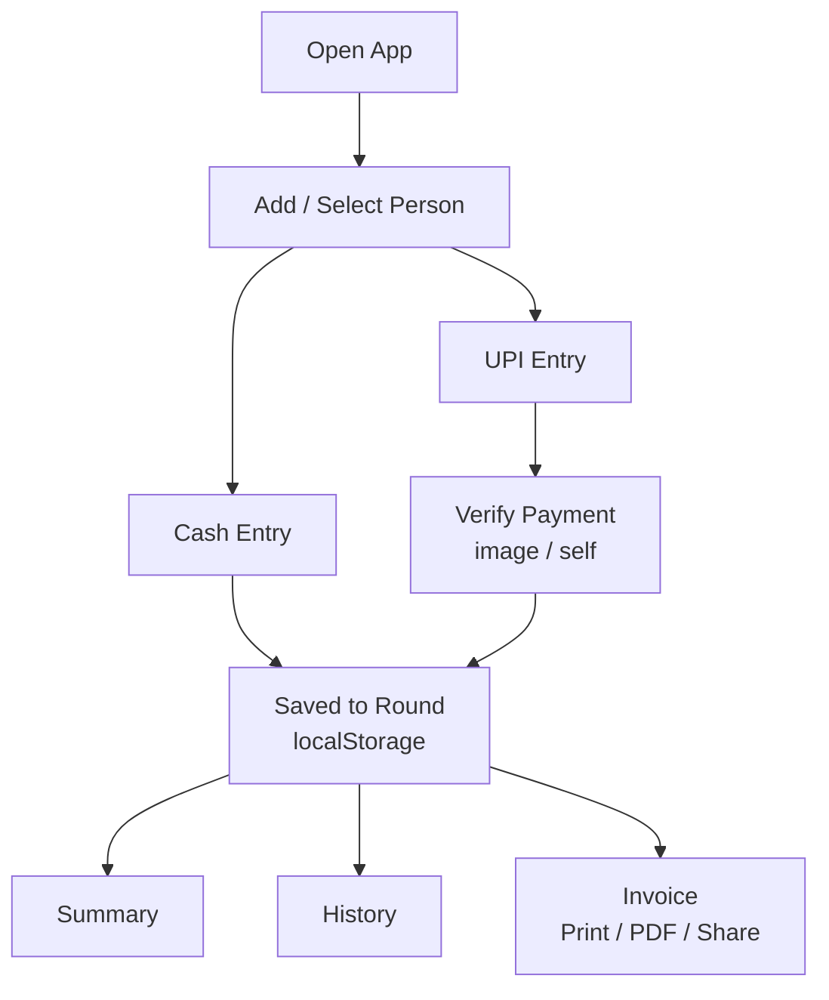
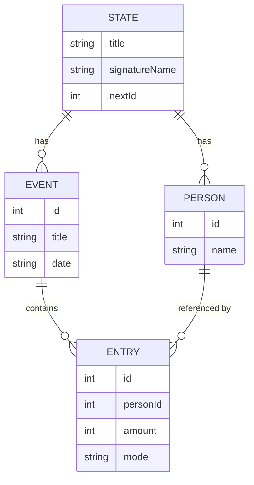
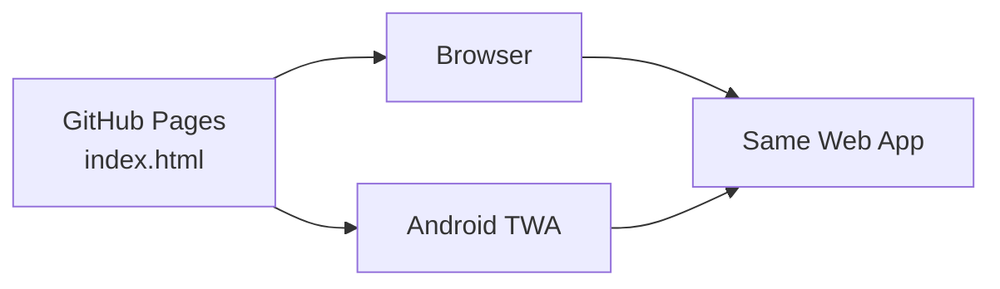
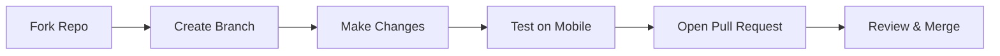

<table>
<tr>
<td></td>
<td>

# Collection Sathi
Simple, local-first collection tracking — Cash + UPI, verified payments, history & instant invoices.

</td>
</tr>
</table>

<p>
  
  
  
</p>

A free, open-source app to track group money collections — built for **chanda, festival funds, class collections, and community contributions**. No login, no server — everything stays on your device.

---
> **Simple • Local • Open Source • Collection Management**

Collection Sathi is a lightweight, mobile-first web application for recording group money collections with **Cash + UPI support**, **multi-round history**, **UPI verification**, **payment-proof image archiving**, **summaries**, **printable invoices**, **image sharing**, and a locally saved **UPI QR code**.

It is designed for practical collection workflows such as **chanda, festival funds, class collections, community contributions, events, and small group records**.

---

# Collection Sathi

<p align="center">
  
</p>

<p align="center">
  <strong>Simple, local collection management.</strong><br>
  Record collections, verify UPI payments, preserve payment proofs, and generate clean reports.
</p>

<p align="center">
  <a href="https://github.com/VinaySoni-IN/Collection-Sathi/releases/latest">
    
  </a>
  &nbsp;
  <a href="https://vinaysoni-in.github.io/Collection-Sathi/">
    
  </a>
  &nbsp;
  <a href="">
    
  </a>
</p>

<p align="center">
  <sub>Cash • UPI • Verification • Payment Proof • History • Reports</sub>
</p>

---

## ✨ Features

| | |
|---|---|
| 👥 **People** | Reusable person records, no re-typing names |
| 💵📲 **Cash + UPI** | Track both, with per-entry mode |
| ✅ **UPI Verification** | Mark verified, attach proof, or self-verify |
| 🔄 **Multiple Rounds** | Independent collection sessions with full history |
| 📊 **Summary** | Totals, average, max, Cash/UPI split |
| 🧾 **Invoice** | Printable, signed, shareable as an image |
| 🔳 **UPI QR** | Save your QR once, reuse every round |
| 💾 **Local-first** | Your data never leaves your device |

## 🧭 Sections

| Collect | Summary | History | Invoice |
|---|---|---|---|
| Add & verify payments | Totals & stats | All rounds, switch anytime | Print, PDF, share |
## 📱 Screenshots

<table>
<tr>
<td align="center"><br><sub>Home Screen</sub></td>
<td align="center"><br><sub>Add Person</sub></td>
<td align="center"><br><sub>UPI Verification</sub></td>
</tr>
<tr>
<td align="center"><br><sub>Summary</sub></td>
<td align="center"><br><sub>History</sub></td>
<td align="center"><br><sub>Invoice</sub></td>
</tr>
</table>

## 🛠️ Tech Stack

Plain HTML, CSS & JavaScript — no framework required.

`localStorage` · `IndexedDB` · Canvas API · Web Share API · Service Worker · Web App Manifest · `html2canvas`
## 🗂️ File Structure

```text
Collection-Sathi/
│
├── index.html              # App UI, CSS & JavaScript (self-contained)
├── manifest.json           # PWA config — name, icons, theme
├── sw.js                   # Service worker (installable + offline)
├── icon-192.png            # App icon (small)
├── icon-512.png            # App icon (large)
├── LICENSE                 # MIT License
└── README.md               # This file
```
## 🔄 How It Works


## 🧱 Data Model


## 🏗️ Architecture



## 🚧 Production Readiness

Currently in **active development** — functional and usable, not yet a finished v1.

**Ready:** core collection flow · invoices (print/share) · UPI verification + proof storage · local persistence · installable PWA
**Not yet ready:** backup/export · cross-device testing · signed release APK · versioned releases

> Use it for real collections at your own discretion — keep a manual backup of totals until export/backup ships.

## 🗺️ Roadmap

- [ ] Export / Import (JSON, CSV)
- [ ] Search & filter entries
- [ ] Proof archive viewer + cleanup
- [ ] Dark mode
- [ ] Signed, versioned APK releases
- [ ] F-Droid listing
- [ ] Optional encrypted backup

## 🤝 Contributing & Contribution Flow

Contributions are welcome — keep changes compatible with existing stored data, and test on mobile before submitting.


---

<p align="center">
<sub>
Collection Sathi is provided "as is" without warranty of any kind — the developer is not liable for any loss of data, funds, or disputes arising from its use. All collection data is stored locally on your device; nothing is uploaded to any server, and you are solely responsible for backing up and verifying your own records. This project is licensed under the <a href="LICENSE">MIT License</a> — free to use, modify, and share, with attribution appreciated. Built with respect and gratitude for the open-source community that makes projects like this possible.
</sub>
</p>

<p align="center">
<sub>
Made with ❤️ by <a href="https://github.com/VinaySoni-IN">Vinay Soni</a> · Built with <a href="https://claude.ai">Claude</a>
</sub>
</p>
